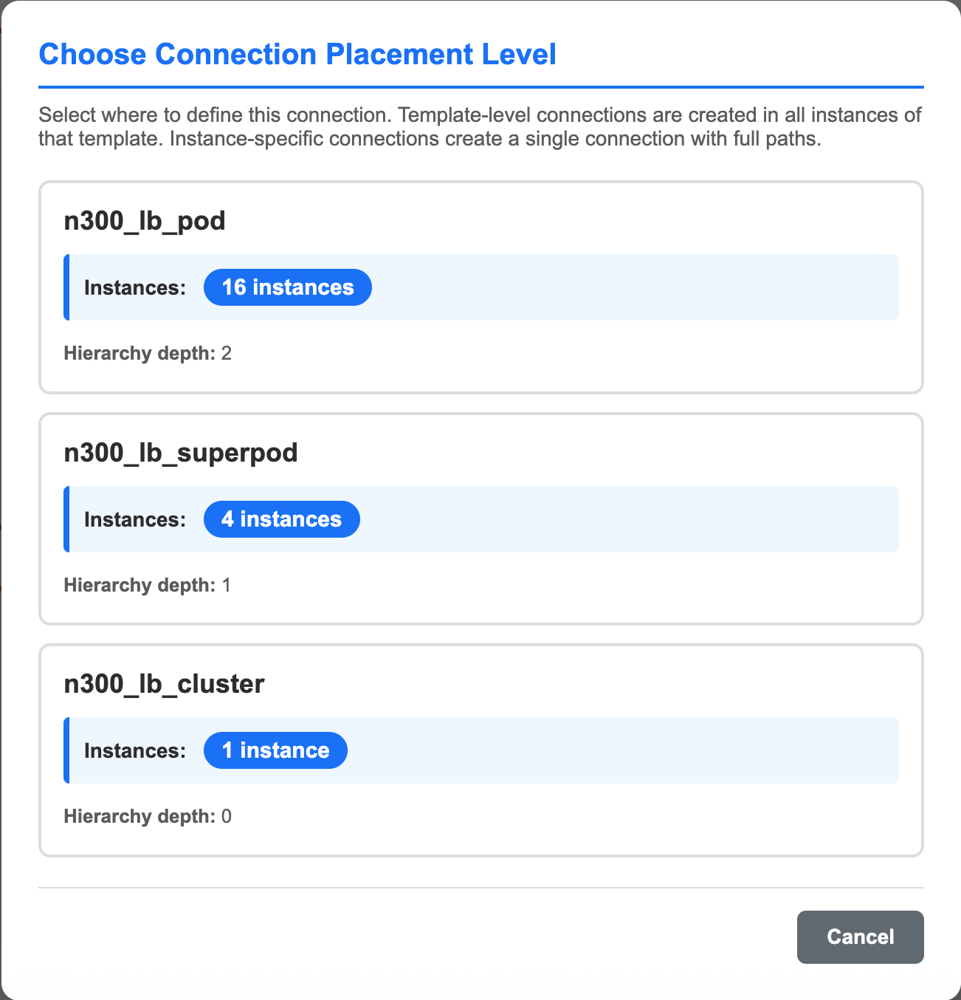
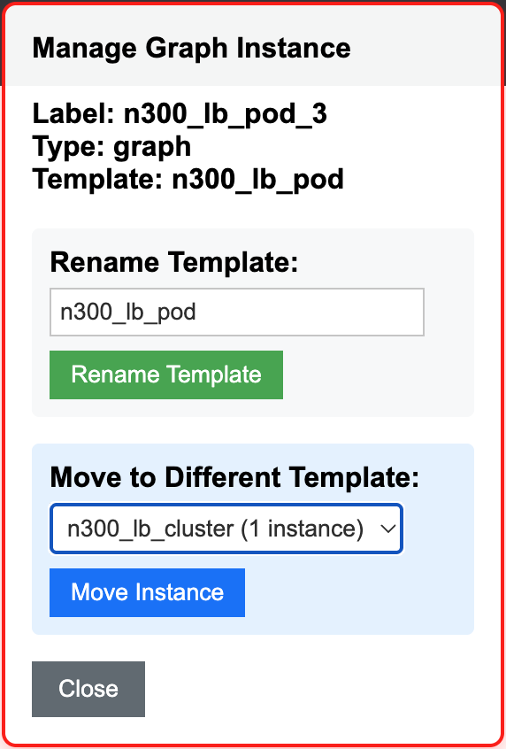
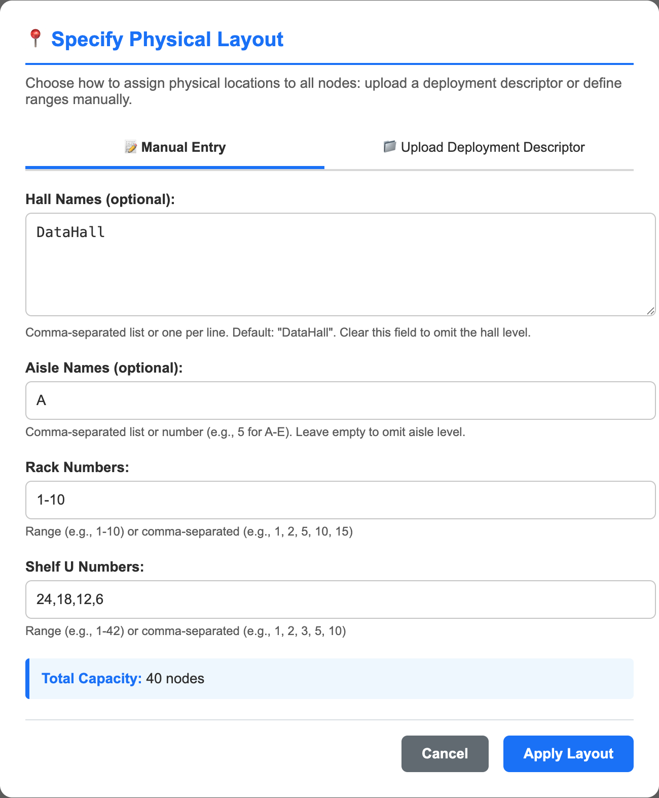

# tt-CableGen Logical Hierarchy Mode

This document covers the specifics of interacting with tt-CableGen in **Hierarchy Mode** (Logical Hierarchy View).

<!-- Remember to update the table of contents when adding new sections -->
## Table of Contents

- [Overview](#overview)
- [Getting Started](#getting-started)
  - [Entering Hierarchy Mode](#entering-hierarchy-mode)
  - [Mode Indicator](#mode-indicator)
- [Key Features](#key-features)
  - [1. Graph Template System](#1-graph-template-system)
  - [2. Hierarchical Structure](#2-hierarchical-structure)
  - [3. Connection Visualization](#3-connection-visualization)
  - [4. Node Management](#4-node-management)
- [Common Usage Patterns](#common-usage-patterns)
  - [Importing a Topology](#importing-a-topology)
  - [Adding a Graph Template Instance](#adding-a-graph-template-instance)
  - [Collapsing/Expanding Graph Instances](#collapsingexpanding-graph-instances)
  - [Adding Connections](#adding-connections)
  - [Editing Node Properties](#editing-node-properties)
  - [Switching to Location Mode](#switching-to-location-mode)
- [UI Elements Specific to Hierarchy Mode](#ui-elements-specific-to-hierarchy-mode)
  - [Visible Elements](#visible-elements)
  - [Hidden Elements](#hidden-elements)
  - [Node Labels](#node-labels)
- [Import/Export Considerations](#importexport-considerations)
  - [Import Formats](#import-formats)
  - [Export Formats](#export-formats)
- [Tips and Best Practices](#tips-and-best-practices)
- [Recommended Workflow](#recommended-workflow)
- [Limitations](#limitations)
- [Related Documentation](#related-documentation)

<p align="center">
  
  <br>
  <em>Example: 16 Wormhole Loudbox systems in a hierarchical topology</em>
</p>

## Overview

Hierarchy Mode organizes nodes by their logical topology structure, focusing on **graph templates** and **instances** rather than physical location. This mode is ideal for:

- Designing topology templates and their relationships
- Understanding logical node groupings and connections
- Working with TextProto descriptor files
- Template-based topology design and instantiation

**Key Characteristic**: Nodes are organized by graph templates → instances → shelves, ignoring physical location data.

## Getting Started

### Entering Hierarchy Mode

Hierarchy Mode is automatically activated when:

1. **Importing a TextProto file** (`.textproto`) containing `CablingDescriptor` format
2. **Creating an empty canvas** from the Hierarchy tab 

### Mode Indicator

When in Hierarchy Mode, you'll see a yellow indicator banner in the sidebar:
- **🌳 Logical Hierarchy View**

## Key Features

### 1. Graph Template System

- **Template-based organization**: Nodes are grouped by their graph template definitions
- **Template instantiation**: Create new instances of graph templates
- **Template filtering**: Filter connections by template name

### 2. Hierarchical Structure

The visualization follows this hierarchy:
```
Graph Template Instance (top level)
  └── Graph Template Instance (nested, can be many levels)
      └── Shelf Node
          └── Tray
              └── Port
```

### 3. Connection Visualization

- **Template-based coloring**: Connections are colored by their template name
- **Depth-based organization**: Visual depth indicates hierarchy level
- **Filtering**: Users can pare down the connections exposed by filtering by the defining template or endpoint nodes under the "Connection Options" section.
- **Node Connections**: Internal node connections are shown in green
- **Collapse/Expand**: Collapse graph instances to simplify the view

### 4. Node Management

- **Add Graph Template Instances**: Create new instances from available templates
- **Add Shelf Nodes**: Create individual shelf nodes (with trays and ports)

## Common Usage Patterns

### Importing a Topology

1. Drag & drop a `.textproto` file onto the application
2. Click **"Generate Visualization"**
3. The system automatically detects the descriptor format and enters Hierarchy Mode
4. Graph templates are extracted and available for instantiation

### Adding a Graph Template Instance

1. Enable **Cabling Editing** mode, under the "Cabling Editor" section (if not already enabled)
2. Navigate to the **"Add Graph Template Instance"** section
3. Select a template from the dropdown
4. Optionally select a parent graph node (or leave unselected for top-level)
5. Click **"Add Graph Instance"**
6. The new instance appears with all its children and connections

### Collapsing/Expanding Graph Instances

1. Double-Click on a graph node to expand or collapse it
2. Use the **"Collapse One Level"** button to collapse all lowest-level nodes
3. Use the **"Expand One Level"** button to expand all lowest-level nodes
4. This helps manage complex topologies with many nested instances

### Adding Connections

Creating connections in Hierarchy Mode allows you to specify which template level should contain the connection. This is important because connections can be placed at different levels of the hierarchy, affecting how they're defined in the exported topology.

**Basic Connection Creation:**
1. Enable **Cabling Editing** mode (if not already enabled)
2. Click on an **unconnected port** (highlighted in orange) to select it as the source
3. Click on another **unconnected port** to create the connection

**Template Level Selection:**
When you create a connection between two ports, the system automatically determines all possible template levels where the connection could be placed. These are the common ancestor graph templates that contain both nodes/ports.

- **Single Level Available**: If only one template level is possible, the connection is created automatically at that level
- **Multiple Levels Available**: If multiple template levels are possible, a modal dialog appears showing:
  - **Template Name**: The name of the template that would contain the connection
  - **Instances**: How many instances of that template would receive this connection
  - **Hierarchy Depth**: The depth level in the hierarchy
  
  Select the desired template level by clicking on it in the modal.

**Understanding Template Levels:**
- **Lower-level templates** (closer to shelf nodes): Connections are specific to individual instances
- **Higher-level templates** (closer to root): Connections apply to all instances of that template, creating a reusable connection pattern

<p align="center">
  
  <br>
  <em>Example: Connection Placement Modal example showing connection options for adding a connection to the image at the top of the page</em>
</p>

**Example**: If you have a topology with a "superpod" template containing multiple "pod" templates, and each pod contains shelf nodes:
- Placing a connection at the "pod" level creates the connection in all pod instances within that superpod, and any other "pod" instances.
- Placing a connection at the "superpod" level creates one connection at the superpod level.

**Note**: Each port can only have one connection. If a port is already connected, you must delete the existing connection before creating a new one.

### Editing Node Properties

Right-click any node to edit its properties. This feature requires **Cabling Editing** mode to be enabled.

**Shelf Nodes:**
- **Move to Different Template**: Move the shelf node to a different graph template instance. Useful for reorganizing nodes within your topology structure.

**Graph Template Instances:**
<p align="center">
  
  <br>
  <em>Example: Graph Instance Node Edit Dialog box showing the options for renaming and moving the graph instance</em>
</p>

- **Rename Template**: Change the template name for a graph instance. This updates the template name for this instance and can help clarify the purpose of different graph instances.
- **Move to Different Template**: Move the entire graph instance (and all its children) to a different template. Useful for restructuring your topology hierarchy.
- **Add A New Template**: Add a new graph template instance. This will create a new named template you can place in the hierarchy.

**Note**: Template operations affect all instances of the template. Use these features to refine your topology design as you iterate on the layout.

### Switching to Location Mode
<p align="center">
  
  <br>
  <em>Example: Physical Layout Modal example showing the options for configuring the physical layout</em>
</p>

1. Click the mode toggle button
2. If nodes don't have physical locations, a modal will appear
3. Configure physical layout (hall, aisle, rack, shelf units) or import a Deployment Descriptor.
4. Click **"Apply Physical Layout"** to switch modes
5. **Note**: You can only switch modes if the session started in Hierarchy Mode

## UI Elements Specific to Hierarchy Mode

### Visible Elements

- ✅ **Graph Template Instance** section (Add Graph button)
- ✅ **Template Filter** dropdown
- ✅ **Template-based Connection Legend**
- ✅ **Logical node creation** (no physical location fields)

### Hidden Elements

- ❌ **Location Type Filters** (same host, same rack, etc.) - Location Mode only
- ❌ **Physical Location Fields** (hall, aisle, rack, shelf) - Location Mode only

### Node Labels

Shelf nodes display:
- Host index/hostname
- Template path information
- Node reference numbers

## Import/Export Considerations

### Import Formats

- **Cabling Descriptor TextProto** (`.textproto`): Full support for graph templates and hierarchy
- **Deployment Descriptor TextProto** (`.textproto`): Will be good to have for a topology that is being iterated over, to transfer easily from the Hierarchical View to Location View.

### Export Formats

- **Cabling Descriptor**: Exports the logical graph topology structure

## Tips and Best Practices

1. **Template Design**: Design reusable graph templates before creating multiple instances
2. **Naming Conventions**: Use clear, descriptive template names for easier filtering
3. **Hierarchy Depth**: Keep template nesting reasonable for clarity
4. **Collapse Large Topologies**: Use collapse/expand to manage complex visualizations
5. **Template Colors**: Each template gets a unique color - use this for quick visual identification
6. **Visual Clarity**: Use template filters to visually verify specific template connections between hosts. 

## Recommended Workflow

Recommended to use Hierarchy Mode's CablingDescriptor import/export loop while iterating on a topology. This allows for easy export/sharing of the topology structure. Then when aspects like number of nodes, node groupings are solidified, switch to Location Mode to configure the physical layout and export a Deployment Descriptor. This will allow you to keep iterating on logical topology while keeping a physical placement structure that can be applied at any time.

## Limitations

- Physical location data is ignored in this mode

## Related Documentation

- [README.md](README.md) - General application documentation
- [README-LOCATION.md](README-LOCATION.md) - Location Mode documentation
- [TT-Metal Scaleout Tools](https://github.com/tenstorrent/tt-metal/tree/main/tools/scaleout) - Descriptor format reference
