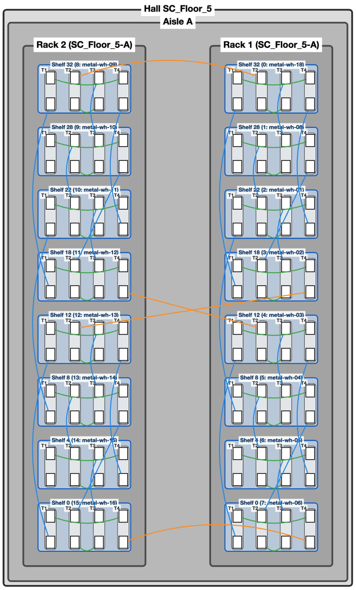

# tt-CableGen Physical Location Mode

This document covers the specifics of interacting with tt-CableGen in **Location Mode** (Physical Location View).

<!-- Remember to update the table of contents when adding new sections -->
## Table of Contents

- [Overview](#overview)
- [Getting Started](#getting-started)
  - [Entering Location Mode](#entering-location-mode)
  - [Mode Indicator](#mode-indicator)
- [Key Features](#key-features)
  - [1. Physical Hierarchy](#1-physical-hierarchy)
  - [2. Location-Based Organization](#2-location-based-organization)
  - [3. Connection Visualization](#3-connection-visualization)
  - [4. Connection Type Filters](#4-connection-type-filters)
  - [5. Node Management](#5-node-management)
- [Common Workflows](#common-workflows)
  - [Importing a CSV with Location Data](#importing-a-csv-with-location-data)
  - [Assigning Physical Locations](#assigning-physical-locations)
  - [Filtering Connections by Type](#filtering-connections-by-type)
  - [Adding Nodes in Location Mode](#adding-nodes-in-location-mode)
  - [Adding Connections](#adding-connections)
  - [Collapsing/Expanding Racks](#collapsingexpanding-racks)
  - [Editing Node Properties](#editing-node-properties)
- [UI Elements Specific to Location Mode](#ui-elements-specific-to-location-mode)
  - [Visible Elements](#visible-elements)
  - [Hidden Elements](#hidden-elements)
  - [Node Labels](#node-labels)
- [Import/Export Considerations](#importexport-considerations)
  - [Import Formats](#import-formats)
  - [Export Formats](#export-formats)
- [Tips and Best Practices](#tips-and-best-practices)
- [Limitations](#limitations)
- [Related Documentation](#related-documentation)

<p align="center">
  
  <br>
  <em>Example: 16 Wormhole Loudbox systems in a physical deployment view</em>
</p>

## Overview

Location Mode organizes nodes by their **physical data center location**, focusing on where hardware is actually deployed rather than logical topology. This mode is ideal for:

- Visualizing physical racking and data center layout
- Understanding spatial relationships between nodes
- Working with CSV files containing location data
- Planning physical cable routing and deployment

**Key Characteristic**: Nodes are organized by hall → aisle → rack → shelf, ignoring logical topology structure.

## Getting Started

### Entering Location Mode

Location Mode is automatically activated when:

1. **Importing a CSV file** with location columns (hall, aisle, rack_num, shelf_u)
2. **Switching from Hierarchy Mode** (after assigning physical locations)
3. **Creating an empty canvas** while already in Location Mode

### Mode Indicator

When in Location Mode, you'll see a blue indicator banner in the sidebar:
- **📍 Physical Location View**

**Note**: If the session started from a CSV import, the mode indicator is hidden (since mode switching is disabled).

## Key Features

### 1. Physical Hierarchy

The visualization follows this hierarchy:
```
Hall
  └── Aisle
      └── Rack
          └── Shelf Node
              └── Tray
                  └── Port
```

### 2. Location-Based Organization

- **Hall grouping**: Nodes grouped by data hall
- **Aisle grouping**: Within halls, nodes grouped by aisle
- **Rack grouping**: Within aisles, nodes grouped by rack number
- **Shelf positioning**: Shelves positioned by shelf unit (U) number

### 3. Connection Visualization

Connections are colored based on physical proximity:
- **Same host**: Green - Connections within the same shelf node
- **Same rack**: Blue - Connections between shelves in the same rack
- **Same aisle**: Orange - Connections between racks in the same aisle
- **Same hall**: Purple - Connections between aisles in the same hall
- **Different halls**: Red - Connections between different halls

### 4. Connection Type Filters

These are available in the "Connection Options" section.

Filter connections by physical relationship:
- ✅ Show same host connections
- ✅ Show same rack connections
- ✅ Show same aisle connections
- ✅ Show same hall connections
- ✅ Show different hall connections

Can also filter by endpoint nodes.

### 5. Node Management

- **Add Shelf Nodes**: Create nodes with physical location fields
- **Physical Location Assignment**: Assign hall/aisle/rack/shelf locations
- **Rack Collapse/Expand**: Collapse racks to simplify the view
- **Location-based Layout**: Automatic layout based on physical positions

## Common Workflows

### Importing a CSV with Location Data

1. Drag & drop a CSV file with location columns onto the application
2. Click **"Generate Visualization"**
3. The system automatically detects location columns and enters Location Mode
4. Nodes are organized by their physical location hierarchy

### Assigning Physical Locations

1. Switch from Hierarchy Mode (if applicable)
2. If nodes don't have physical locations, a modal will appear
3. Configure the physical layout:
   - **Hall Names**: Comma-separated or one per line (e.g., "DataHall" or "Hall1, Hall2")
   - **Aisle Names**: Numbers (1-26) or letters (e.g., "A" or "1-5" for A-E)
   - **Rack Numbers**: Range or list (e.g., "1-10" or "1,2,5,10")
   - **Shelf Units**: List of U positions (e.g., "24,18,12,6")
4. Click **"Apply Physical Layout"**
5. Nodes are automatically assigned locations and organized

### Filtering Connections by Type

1. Use the checkboxes in the **Connection Type Filters** section
2. Toggle specific connection types on/off
3. The visualization updates to show only selected connection types
4. Useful for identifying long-distance vs. local connections

### Adding Nodes in Location Mode

1. Enable **Cabling Editing** mode (if not already enabled)
2. Navigate to the **"Add New Node"** section
3. Fill in physical location fields:
   - Hall (optional)
   - Aisle (optional)
   - Rack Number
   - Shelf Unit (U)
4. Select node type and variation
5. Click **"Add Node"**
6. The node appears in the appropriate rack location

### Adding Connections

Creating connections in Location Mode is straightforward - connections are created directly between ports without template level selection, since Location Mode focuses on physical deployment.

**Basic Connection Creation:**
1. Enable **Cabling Editing** mode (if not already enabled)
2. Click on an **unconnected port** (highlighted in orange) to select it as the source
3. Click on another **unconnected port** to create the connection

**Note**: Each port can only have one connection. If a port is already connected, you must delete the existing connection before creating a new one.

### Collapsing/Expanding Racks

1. Click on a rack node to select it
2. Use collapse/expand controls to simplify the view
3. Useful for managing large deployments with many racks

### Editing Node Properties

Right-click any node to edit its properties. This feature requires **Cabling Editing** mode to be enabled.

**Hall Nodes:**
- **Hall**: Edit the hall name (updates all aisles and their descendants within this hall)

**Aisle Nodes:**
- **Hall**: Edit the hall name (updates all racks and their descendants within this aisle)
- **Aisle**: Edit the aisle name (updates all racks and their descendants within this aisle)

**Rack Nodes:**
- **Hall**: Edit the hall name (updates all shelves within this rack)
- **Aisle**: Edit the aisle name (updates all shelves within this rack)
- **Rack**: Edit the rack number (updates all shelves within this rack)

**Shelf Nodes:**
- **Hostname**: Edit the hostname for the shelf node
- **Hall**: Edit the hall name 
- **Aisle**: Edit the aisle name 
- **Rack**: Edit the rack number 
- **Shelf U**: Edit the shelf unit position 

**Note**: Changes to parent nodes (hall, aisle, rack) automatically propagate to all child nodes, making it easy to reorganize large sections of your deployment.

## UI Elements Specific to Location Mode

### Visible Elements

- ✅ **Connection Type Filters** (same host, same rack, etc.)
- ✅ **Physical Location Fields** (hall, aisle, rack, shelf) when adding nodes
- ✅ **Location-based Connection Legend** (showing racking hierarchy colors)
- ✅ **Rack-based organization**

### Hidden Elements

- ❌ **Graph Template Instance** section - Hierarchy Mode only
- ❌ **Template Filter** dropdown - Hierarchy Mode only
- ❌ **Template-based Connection Legend** - Hierarchy Mode only

### Node Labels

Shelf nodes display:
- Shelf unit number (U)
- Host index/hostname
- Format: `Shelf {shelf_u} ({host_index}: {hostname})`

Rack nodes display:
- Rack number
- Hall and aisle: `Rack {rack_num} ({hall}-{aisle})`

## Import/Export Considerations

### Import Formats

- **CSV with location columns**: Full support, automatically enters Location Mode
- **TextProto**: Will enter Hierarchy Mode first, then can switch to Location Mode

### Export Formats

- **Cabling Guide**: Primary export format for Location Mode (CSV instructions for technicians)
- **Deployment Descriptor**: Exports physical location mappings
- **Cabling Descriptor**: Will export a flat cabling descriptor with all nodes and connections.
- **FSD**: Will export a FSD file with all nodes and connections, useful for physically validating deployed systems. See [TT-Metal Scaleout Tools](https://github.com/tenstorrent/tt-metal/tree/main/tools/scaleout) for more information.

## Tips and Best Practices

1. **Consistent Naming**: Use consistent hall/aisle naming conventions across your deployment
2. **Rack Planning**: Plan rack assignments before importing to minimize reorganization
3. **Connection Filtering**: Use connection type filters to visually identify cable routing challenges
5. **Visual Organization**: Use collapse/expand to focus on specific areas of the data center
6. **Color Coding**: Use connection colors to quickly identify long-distance connections


## Limitations

- **Mode Switching**: Cannot switch to Hierarchy Mode if session started from CSV import
  - This is intentional because CSVs do not contain hierarchical structure information. So working in Hierarchy Mode after importing a CSV is not generally useful or and efficient workflow.
- **Logical Structure**: Graph template information is hidden in this mode
- **Template Instantiation**: Cannot work with graph template instances (Hierarchy Mode only)

## Related Documentation

- [README.md](README.md) - General application documentation
- [README-HIERARCHY.md](README-HIERARCHY.md) - Hierarchy Mode documentation
- [TT-Metal Scaleout Tools](https://github.com/tenstorrent/tt-metal/tree/main/tools/scaleout) - Descriptor format reference
