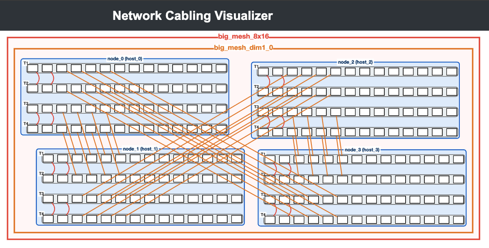

# tt-CableGen: Network Cabling Visualizer for Tenstorrent Scale-Out Deployments

For scale-out deployments of Tenstorrent Wormhole and Blackhole hardware, this tool can be used to visualize how to connect multiple systems for a specific multi-node scale-out topology.


<p align="center">
  
  <br>
  <em>Example: 4× BH-Galaxy systems forming an 8×16 mesh with 2D-torus connections</em>
</p>

## Quick Start

### Prerequisites

Currently requires TT-Metal to be installed and built from source:

See the [TT-Metal Installation Guide](https://github.com/tenstorrent/tt-metal/blob/main/INSTALLING.md#source) for more details on how to install TT-Metal.

```bash
export TT_METAL_HOME=/path/to/tt-metal

# Install dependencies
pip install -r requirements.txt

# Run the server
python server.py

# Open in browser
open http://localhost:5000
```

Select a predefined topology from the [Defined Topologies](defined_topologies/README.md) folder and upload the CSV or TextProto file to visualize your network topology. Alternatively, click **"Create Empty Canvas"** to build one from scratch!

## What Can It Do?

| Feature | Description |
|---------|-------------|
| **Visualize** | Interactive graph with pan, zoom, and hierarchical node structure |
| **Import** | Load topology from CSV or TextProto cabling descriptors |
| **Edit** | Add/remove nodes, create connections, modify properties |
| **Export** | Generate cabling descriptors, deployment descriptors, and cabling guides |

## Supported Hardware

- **Wormhole**: WH_GALAXY variants, N300_LB, N300_QB
- **Blackhole**: BH_GALAXY variants, P150_LB, P150_QB variants

## Basic Usage

### Importing a Topology

1. Drag & drop a `.csv` or `.textproto` file onto the upload area
2. Click **"Generate Visualization"**

### Editing

- **Add nodes**: Use "Add New Node" panel to create shelf nodes
- **Create connections**: Enable edit mode → click source port → click destination port
- **Edit nodes**: Double-click any shelf node
- **Delete**: Select item + press Delete/Backspace

### Exporting

- **Cabling Descriptor**: Topology definition (hierarchy-based)
- **Deployment Descriptor**: Physical location mapping
- **Cabling Guide**: CSV instructions for technicians (requires `TT_METAL_HOME`)

## Docker Deployment

See [README-COMPOSE.md](README-COMPOSE.md) for containerized deployment options.

---

<details>
<summary><strong>📚 Detailed Documentation</strong></summary>

## Visualization Modes

### Location Mode (CSV Import)
Organizes nodes by physical data center location (Hall → Aisle → Rack → Shelf). Nodes appear grouped within rack compounds that can be collapsed/expanded.

### Hierarchy Mode (TextProto Import)
Organizes nodes by logical topology (Graph Templates → Instances → Shelves). Useful for template-based topology design.

## File Format Reference

### CSV Import Formats

**Hierarchical CSV** (with location info):
```
hostname, hall, aisle, rack_num, shelf_u, tray, port, cable_type, cable_length, dest_hostname, dest_hall, dest_aisle, dest_rack_num, dest_shelf_u, dest_tray, dest_port
```

**Simplified CSV** (hostname-based):
```
hostname, tray, port, cable_type, cable_length, dest_hostname, dest_tray, dest_port
```

The parser auto-detects the format based on column headers.

### TextProto Format

See [TT-Metal Scaleout tools](https://github.com/tenstorrent/tt-metal/tree/main/tools/scaleout) for the CablingDescriptor protobuf schema.

Basic structure:
```protobuf
graph_templates {
  key: "template_name"
  value {
    children { name: "node1" node_ref { node_descriptor: "P150_LB" } }
    internal_connections {
      key: "QSFP_DD"
      value {
        connections {
          port_a { path: ["node1"] tray_id: 1 port_id: 2 }
          port_b { path: ["node2"] tray_id: 1 port_id: 2 }
        }
      }
    }
  }
}

root_instance {
  template_name: "template_name"
  child_mappings { key: "node1" value { host_id: 0 } }
}
```

## Cabling Guide Generation

Requires TT-Metal to be installed and built:

```bash
export TT_METAL_HOME=/path/to/tt-metal
# Ensure cabling generator is built:
# cd $TT_METAL_HOME && ./build_metal.sh
```

The generator creates:
- **Cabling Guide CSV**: Step-by-step connection instructions
- **Factory System Descriptor**: Complete system specification

## Command Line Options

```bash
python server.py [OPTIONS]

Options:
  -p, --port PORT     Port number (default: 5000)
  --host HOST         Host address (default: 0.0.0.0)
  --debug             Enable debug mode (default)
  --no-debug          Disable debug mode
```

## Project Structure

```
tt-CableGen/
├── server.py                 # Flask web server
├── import_cabling.py         # Parsing and visualization engine
├── export_descriptors.py     # Export logic
├── templates/index.html      # Web interface
├── static/js/visualizer.js   # Client-side application
├── docker-compose.yml        # Docker setup
└── nginx/                    # Nginx/OAuth2 config
```

## Hardware Type Details

| Type | Trays | Ports/Tray | Notes |
|------|-------|------------|-------|
| WH_GALAXY | 4 | 6 | Base Wormhole |
| WH_GALAXY_X_TORUS | 4 | 6 | X-axis torus |
| WH_GALAXY_Y_TORUS | 4 | 6 | Y-axis torus |
| WH_GALAXY_XY_TORUS | 4 | 6 | Full torus |
| N300_LB | 4 | 2 | Horizontal layout |
| N300_QB | 4 | 2 | Horizontal layout |
| BH_GALAXY | 4 | 14 | Base Blackhole |
| BH_GALAXY_X_TORUS | 4 | 14 | X-axis torus |
| BH_GALAXY_Y_TORUS | 4 | 14 | Y-axis torus |
| BH_GALAXY_XY_TORUS | 4 | 14 | Full torus |
| P150_LB | 8 | 4 | Standard P150 |
| P150_QB_AMERICA | 4 | 4 | Horizontal layout |
| P150_QB_GLOBAL | 4 | 4 | Horizontal layout |
| P150_QB_AE | 4 | 4 | AE configuration |

</details>

---

## License

See [LICENSE](LICENSE) file for details.

## Support

For issues or questions, please open an issue in the project repository.
